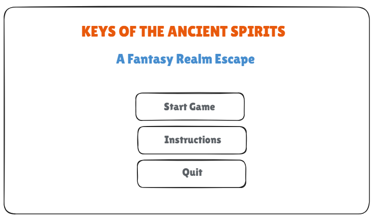

# MystiaJungle

## ✒️ Description

A fantasy adventure game where the player is transported into a mystical world divided into two realms: Summer and Winter.  
The player must collect a sacred key, defeat the realm guardian, and escape the ancient spirit world.

## 🕹️ Gameplay

- Explore Summer Realm → obtain the Sacred Key
- Unlock portal → enter Winter Realm
- Face the Ancient Guardian Boss
- Defeat the Boss → Escape the spirit world
- Avoid enemies and survive through hazards

## 📃 Requirements

Our project satisfies the course requirements:

- State Machines
- Inheritance & Polymorphism
- Entity & Object System
- Factory Pattern
- Enum usage
- Collision detection & Hitboxes
- Persistence
- Win & Loss Conditions
- Sprites & Animation
- Sound & Music
- Fonts
- UI & Instructions
- Juice (Feedback effects)

### 🤖 State Diagram

### 🗺️ Class Diagram

## 🧵 Wireframes

### Title Screen

### Play State - Summer Realm

### Play State - Winter Realm

### Victory State

### Game Over State

## 🎨 Assets

### 🖼️ Images

All wireframe images are stored in the `readme_images/` folder.
In-game sprites and tilesets will be added to the `assets/images/` folder during production.

### ✏️ Fonts

The game uses the default in-engine font for UI, menus, and game text.
Additional fantasy-style fonts will be added for the title screen if needed.

### 🔊 Sounds

Our game uses a combination of music tracks and sound effects to support
immersion, feedback, and clarity in both exploration and combat. All
sounds are organized into two folders: `music/` and `effects/`.

#### 🎵 Music

Background music for game states and environments:

- **title.wav** — Title Screen music
- **summer.wav** — Summer Realm jungle adventure theme
- **winter.wav** — Winter Realm mystical ice theme
- **final.wav** — Final Boss battle (epic)
- **victory.wav** — Short triumphant fanfare played on win
- **gameover.wav** — Short _Epic Failure Boom_ indicating defeat

#### 🔊 Effects

Short SFX used for actions, combat, items, and feedback:

- **sword.wav** — Player sword attack (slash)
- **key.wav** — Key pickup (magical chime)
- **enemy_dead.wav** — Enemy defeated sound
- **boss_dead.wav** — Boss defeat impact
- **door-enter.wav** — Entering a portal/door
- **door-exit.wav** — Leaving a portal/door
- **fire.mp3** — Fire attack / skill
- **frozen.wav** — Ice/freeze effect
- **heal.mp3** — Player healing
- **burst_fire.mp3** — Fire burst / magic shot

## 📚 References
